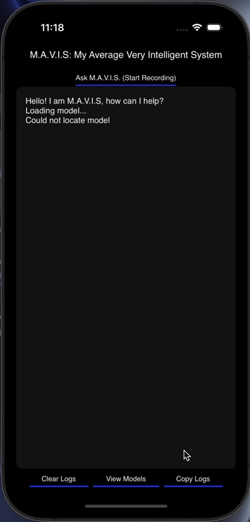

# M.A.V.I.S - My Average Very Intelligent System
A proof of concept on the IOS platform.

---

## Video Walkthrough



## XCFramework
The XCFramework is a precompiled version of the library for iOS, visionOS, tvOS,
and macOS. It can be used in Swift projects without the need to compile the
library from source. For examples:
```swift
// swift-tools-version: 5.10
// The swift-tools-version declares the minimum version of Swift required to build this package.

import PackageDescription

let package = Package(
    name: "Whisper",
    targets: [
        .executableTarget(
            name: "Whisper",
            dependencies: [
                "WhisperFramework"
            ]),
        .binaryTarget(
            name: "WhisperFramework",
            url: "https://github.com/ggml-org/whisper.cpp/releases/download/v1.7.5/whisper-v1.7.5-xcframework.zip",
            checksum: "c7faeb328620d6012e130f3d705c51a6ea6c995605f2df50f6e1ad68c59c6c4a"
        )
    ]
)
                                                             
